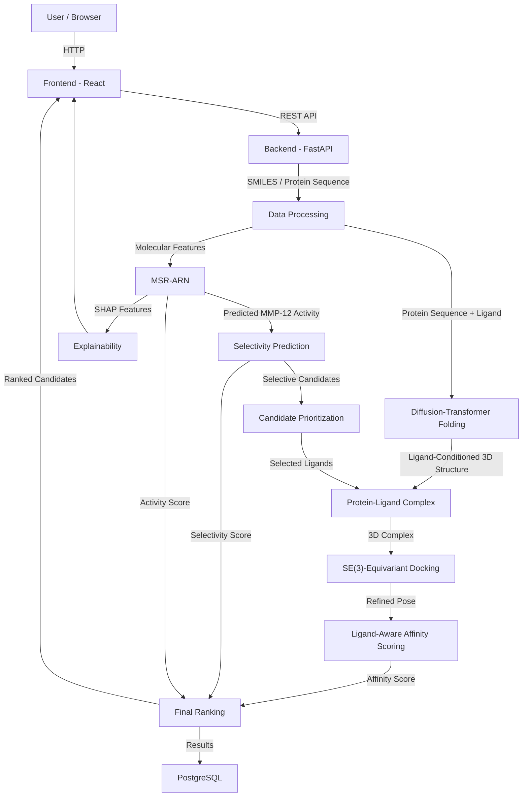

# Architecture

## System Architecture

The proposed system is an integrated AI-driven pipeline for **chemical-space-guided prediction of selective MMP-12 inhibitors**, followed by **ligand-conditioned 3D protein structure prediction** and **ligand-aware binding affinity scoring**.

## Components

| Component                    | Technology               | Responsibility                                                                                                                  |
| ---------------------------- | ------------------------ | ------------------------------------------------------------------------------------------------------------------------------- |
| Frontend                     | React 18                 | Molecular input, protein sequence input, prediction dashboard, ranked candidate visualization, 3D complex visualization         |
| Backend API                  | FastAPI, Python          | API management, workflow orchestration, model inference, data processing and result aggregation                                 |
| Chemical Processing          | RDKit, DeepChem          | SMILES validation, molecular standardization, ECFP4 generation, chemical-space representation and molecular feature preparation |
| Activity Prediction          | TensorFlow / Keras       | MSR-ARN-based prediction of MMP-12 inhibitory activity using multi-scale residual and attention-based deep learning             |
| Selectivity Prediction       | Scikit-learn / ML        | Prediction of MMP-12 selectivity against related MMP isoforms such as MMP-2 and MMP-13                                          |
| Protein Structure Prediction | PyTorch / TensorFlow     | Diffusion-transformer-based ligand-conditioned 3D protein structure prediction                                                  |
| Structure Refinement         | SE(3)-equivariant layers | Iterative refinement of protein atomic coordinates while preserving geometric equivariance                                      |
| Docking & Affinity           | SE(3)-equivariant GNN    | Ligand pose refinement and ligand-aware binding affinity prediction                                                             |
| Explainability               | SHAP                     | Identification of molecular features contributing to activity and selectivity predictions                                       |
| Database                     | PostgreSQL               | Storage of molecular inputs, prediction scores, generated structures, affinity results and experiment metadata                  |
| 3D Visualization             | Mol* / 3Dmol.js          | Visualization of predicted MMP-12 structures, ligand poses and protein-ligand interactions                                      |

## Data Flow

1. **Molecular and protein inputs** are submitted through the React frontend using ligand SMILES/molecular libraries and the MMP-12 protein sequence.

2. **The FastAPI backend** validates the request and sends the inputs to the preprocessing layer.

3. **Chemical preprocessing** uses RDKit/DeepChem to validate structures and generate molecular representations such as ECFP4 fingerprints and other model-ready features.

4. **MSR-ARN processes the molecular representation** using multi-scale convolutional feature extraction, residual learning, SE attention, dilated gated convolutions, multi-head self-attention and feature modulation to predict MMP-12 inhibitory activity.

5. **Selectivity prediction** compares MMP-12 activity with related MMP targets, particularly MMP-2 and MMP-13, to prioritize compounds with predicted MMP-12 selectivity.

6. **Prioritized ligands are passed to the structure-prediction branch**, where protein sequence and ligand information are integrated through ligand-aware transformer cross-attention.

7. **The diffusion-transformer folding module** generates a ligand-conditioned 3D MMP-12 structure through iterative SE(3)-equivariant coordinate refinement.

8. **The predicted protein structure and selected ligand** are combined to form the protein-ligand complex.

9. **The SE(3)-equivariant docking network** performs iterative ligand pose refinement using geometric graph representations, rigid-body transformations and torsional updates.

10. **The affinity prediction head** generates a ligand-aware binding affinity/energy score from the refined complex.

11. **Activity, selectivity and affinity predictions are aggregated** to generate a final ranked list of MMP-12 inhibitor candidates.

12. **SHAP-based explanations and 3D structural visualizations** are returned through the frontend, while prediction results and metadata are stored in PostgreSQL.

## Security Considerations

* API keys, database credentials and model configuration values are stored in environment variables and are never committed to Git.
* Uploaded molecular files are validated before processing to prevent malformed input from reaching the model pipeline.
* Backend API endpoints should require authentication for production deployment.
* Database access should use separate application credentials with minimum required privileges.
* Uploaded datasets and generated structures should use controlled access and should not be exposed through unrestricted public endpoints.
* Prediction requests should be associated with unique identifiers to maintain data isolation between users.

## Scalability Notes

The FastAPI backend is designed to remain stateless so that multiple API instances can be deployed behind a load balancer.

Chemical preprocessing and **MSR-ARN inference can be batch processed** for large molecular libraries. The computationally intensive **diffusion-transformer structure prediction and SE(3)-equivariant docking/affinity stages** can be deployed as GPU-based worker services and scaled independently.

For large-scale virtual screening, a queue-based architecture can distribute thousands of candidate molecules across multiple GPU workers, while PostgreSQL stores intermediate and final prediction results. This allows the hackathon prototype to evolve into a scalable computational drug-discovery platform.
